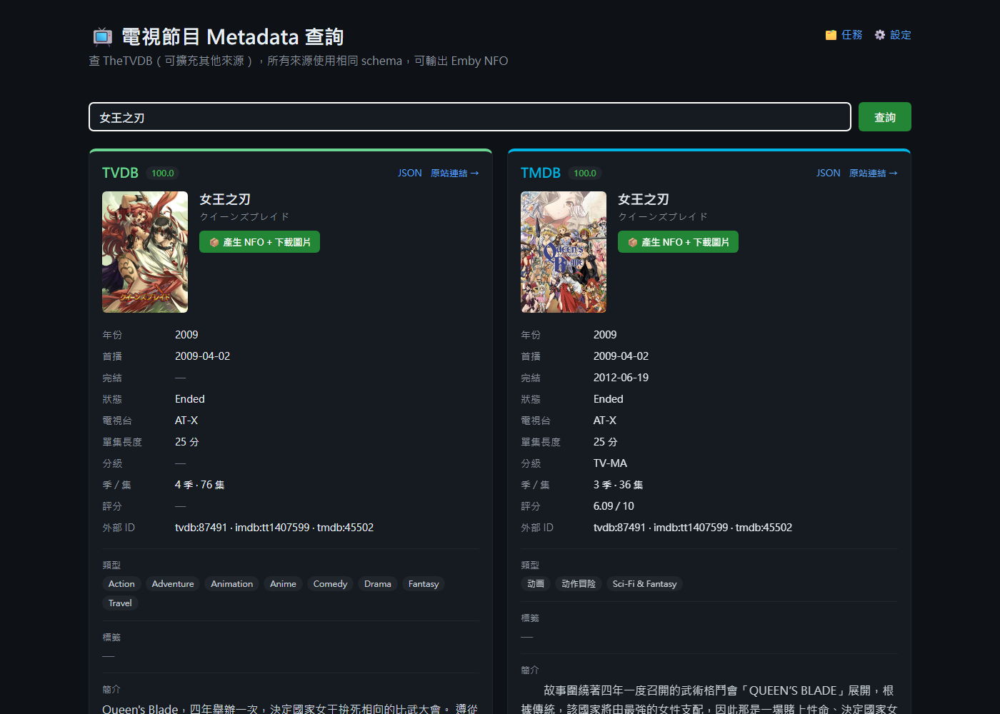
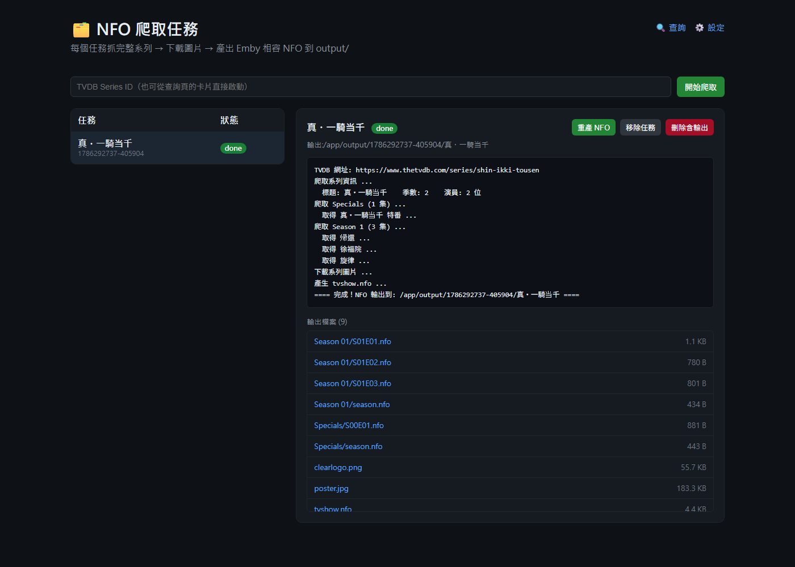
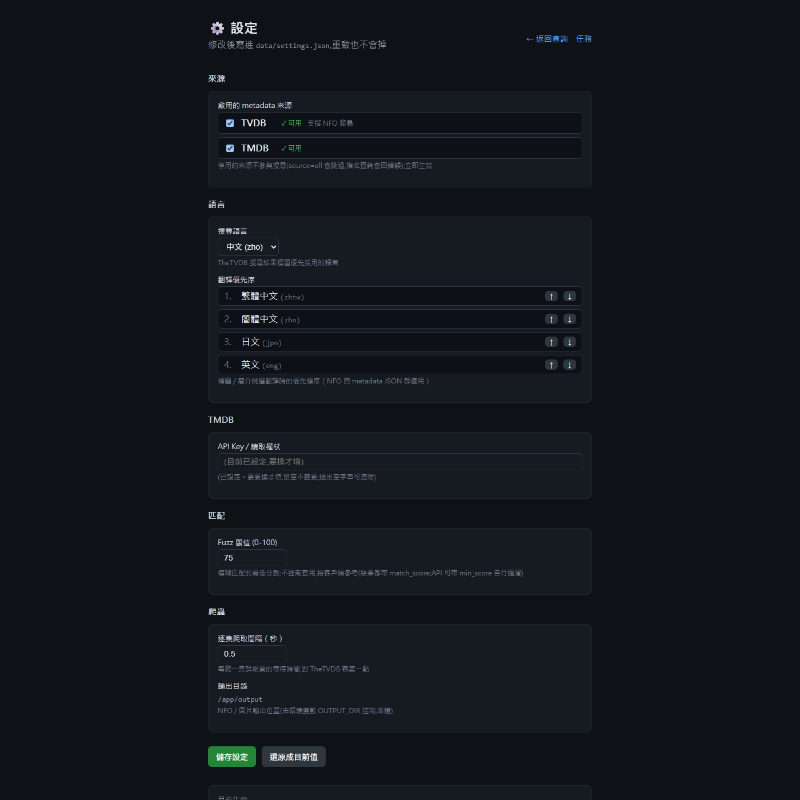

# Show Metadata Syncer

多來源電視節目 / 電影 metadata 服務：**TheTVDB**（純爬蟲，不需 API Key）+ **TMDB**（官方免費 API），
以**統一 canonical JSON**（含圖片 URL）提供 API，並可產生 **Emby / Jellyfin 相容 NFO** 檔案與圖片。

架構與 API 風格對齊姊妹作 [comic-metadata-syncer](https://github.com/acer1204/comic-metadata-syncer)：
FastAPI backend + React (Vite) frontend、來源模組化（要加新來源只要在 `backend/app/sources/` 註冊）。

## 截圖

| 查詢（TVDB + TMDB 雙來源） | NFO 爬取任務 | 設定 |
|---|---|---|
|  |  |  |

```
backend/
  app/
    main.py              # FastAPI 入口（CORS / 靜態前端 / MCP）
    config.py            # env 設定 (pydantic-settings)
    runtime_settings.py  # UI 設定持久化 (data/settings.json)
    crawl.py             # 背景爬蟲任務（NFO + 圖片輸出）
    api/
      preview.py         #   GET /api/preview        快速候選（標題+封面+分數）
      metadata.py        #   GET /api/metadata       canonical JSON（多來源排名）
      nfo.py             #   POST /api/nfo/*         Emby NFO XML 產生器
      tasks.py           #   /api/crawl /api/tasks…  任務管理 + 檔案下載 + 圖片下載
      settings.py        #   GET/PUT /api/settings   執行期設定
    sources/
      base.py            # canonical schema 定義（所有來源共用）
      tvdb.py            # TheTVDB adapter（search/full + 快取，不需 API key）
      tmdb.py            # TMDB adapter（官方免費 API，需在設定頁貼 API key）
      __init__.py        # SOURCES registry ← 新來源在這裡註冊
    clients/
      tvdb.py            # 純爬蟲 + NFO XML 產生（也是 CLI 本體）
frontend/                # React + Vite（查詢 / 任務 / 設定 三頁）
```

## 快速開始

### Docker（建議）

```bash
docker compose up -d --build
```

開 http://localhost:7711 。`./output` 是 NFO 輸出、`./data` 是設定持久化。

### 本機開發

```bash
# 後端 (port 7711)
cd backend
pip install -r requirements.txt
py -m uvicorn app.main:app --port 7711 --reload

# 前端 (port 5174, /api 會 proxy 到 7711)
cd frontend
npm install
npm run dev
```

### CLI（跟以前一樣）

```bash
py tvdb_crawler.py "一騎当千"        # 互動搜尋 + 輸出 NFO
py tvdb_crawler.py -i 80158 -o out  # 直接用 TVDB ID
py tvdb_crawler.py --auto-thumb DIR # ffmpeg 補缺失縮圖
tvdb_crawler.bat web                # 啟動 web 服務
```

## API 總覽

| Method | Path | 說明 |
|---|---|---|
| GET | `/api/health` | 健康檢查 |
| GET | `/api/sources` | 列出已註冊來源與狀態（ready / requires_key / nfo_crawl） |
| GET | `/api/preview?q=&source=all` | 快速候選（不抓詳細頁） |
| GET | `/api/metadata?q=&source=all&episodes=none` | 各來源 top-3 候選的完整 canonical JSON，依 fuzzy 分數排名 |
| GET | `/api/metadata/{source}/{id}?episodes=list` | 單筆完整 canonical JSON（給 Emby-like client 用） |
| POST | `/api/nfo/tvshow` `/api/nfo/season` `/api/nfo/episode` | 回傳 Emby NFO XML 字串（不寫檔） |
| POST | `/api/crawl` | 背景任務：抓整系列 + 下載圖 + 產 NFO 到 output/（body 帶 `source`，tvdb / tmdb 皆支援） |
| GET | `/api/status/{task_id}` | 任務狀態 + log |
| GET/DELETE | `/api/tasks` `/api/tasks/{id}` | 任務清單 / 刪除 |
| GET | `/api/tasks/{id}/files` `/api/tasks/{id}/file?path=` | 輸出檔案清單 / 下載 |
| GET | `/api/tasks/{id}/zip` | 整個輸出資料夾打包 ZIP 下載（解壓即 Emby 影集資料夾） |
| POST | `/api/tasks/{id}/regenerate` | 用快取重產 NFO（不連網） |
| POST | `/api/artwork/*` | 單獨下載系列 / 季 / 集圖片 |
| GET/PUT | `/api/settings` | 語言優先序等執行期設定 |
| — | `/mcp` | 以上端點自動暴露為 MCP tools |

### Emby-like client 的典型流程

```
1. GET /api/preview?q=女王之刃          → 候選清單（id + 標題 + 封面 + 分數）
2. 使用者選一個 id
3. GET /api/metadata/tvdb/87491?episodes=full
   → 一次回全部：系列欄位、演員、genres、圖片 URL、各季各集 title/plot/aired/縮圖 URL
```

`episodes` 參數控制深度：`none`（只有系列+季列表，最快）/ `list`（含每季集數列表）/
`full`(每集詳細頁：plot、導演、編劇，較慢但有 30 分鐘快取)。

### canonical JSON 範例（節錄）

```json
{
  "source": "tvdb",
  "id": "87491",
  "title": "女王之刃",
  "original_title": "クイーンズブレイド",
  "plot": "...",
  "year": "2009", "premiered": "2009-04-02", "status": "Ended",
  "studio": "AT-X", "runtime": "25", "mpaa": "TV-MA",
  "genres": ["Anime", "Fantasy"], "tags": ["..."],
  "unique_ids": {"tvdb": "87491", "imdb": "tt1409055", "tmdb": "", "tvrage": ""},
  "actors": [{"name": "...", "role": "...", "tvdbid": "...", "thumb": "https://..."}],
  "images": {"poster": "https://...", "fanart": "https://...", "clearlogo": "...", "banner": "..."},
  "seasons": [
    {"number": 1, "title": "流浪の戦士", "episode_count": 12, "poster": "https://...",
     "episodes": [{"number": 1, "title": "...", "aired": "2009-04-02", "thumb": "https://..."}]}
  ]
}
```

## TMDB 來源設定

TMDB API 免費（非商業用途），但需要 API key：

1. 到 https://www.themoviedb.org 註冊帳號
2. 設定 → API → 申請 Developer key（即時核發）
3. 把 key 貼到本服務的 **設定頁 → TMDB → API Key**（或 env `TMDB_API_KEY`）

沒設 key 時 TMDB 來源會安靜地回空結果，不影響 TVDB。

## 新增其他來源

1. 新增 `backend/app/sources/<name>.py`，實作 `NAME` / `search()` / `full()` / `empty()`
   （介面與 canonical schema 見 `sources/base.py`，可參考 `tmdb.py` 這個 API 型範例）
2. 在 `backend/app/sources/__init__.py` 的 `SOURCES` 註冊

`/api/preview` 與 `/api/metadata` 的 `source=all` 就會自動涵蓋新來源。

## NFO 輸出結構（Emby 相容）

```
output/{task_id}/{系列名}/
├── tvshow.nfo  poster.jpg  fanart.jpg  clearlogo.png  banner.jpg
├── season01-poster.jpg  season-specials-poster.jpg
├── Season 01/
│   ├── season.nfo
│   ├── S01E01.nfo  S01E01-thumb.jpg  ...
└── Specials/
    ├── season.nfo
    ├── S00E01.nfo  S00E01-thumb.jpg  ...
```
